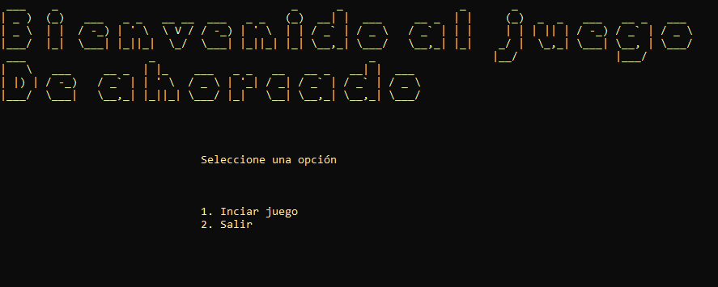
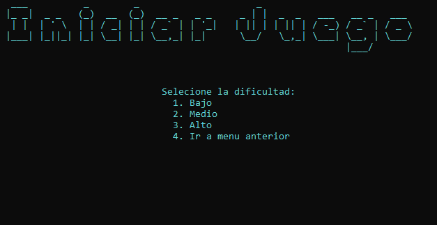
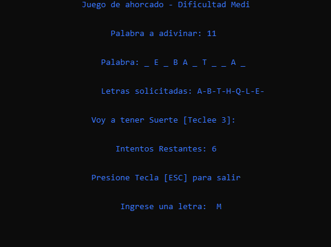
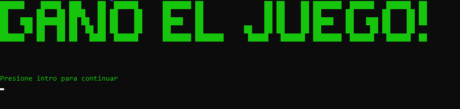
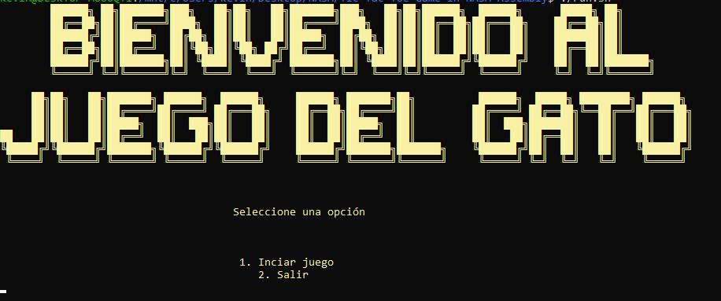
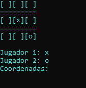
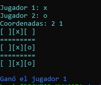

# Assembly-Games-Collection
A collection of assembly language projects showcasing implementations of classic games

## Description

Explore various assembly language projects including classic games like Hangman and Tic-Tac-Toe, along with algorithmic solutions implemented in assembly language.

## How to Install NASM

You can install NASM (Netwide Assembler) on Ubuntu using the following commands:

```bash
sudo apt-get update
sudo apt-get install nasm
sudo apt-get install binutils
```

## How to Run

```bash
./run.sh
```
### Hangman Game






### Tic-Tac-Toe




